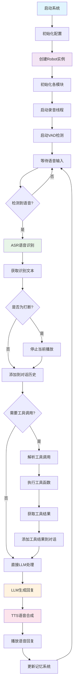
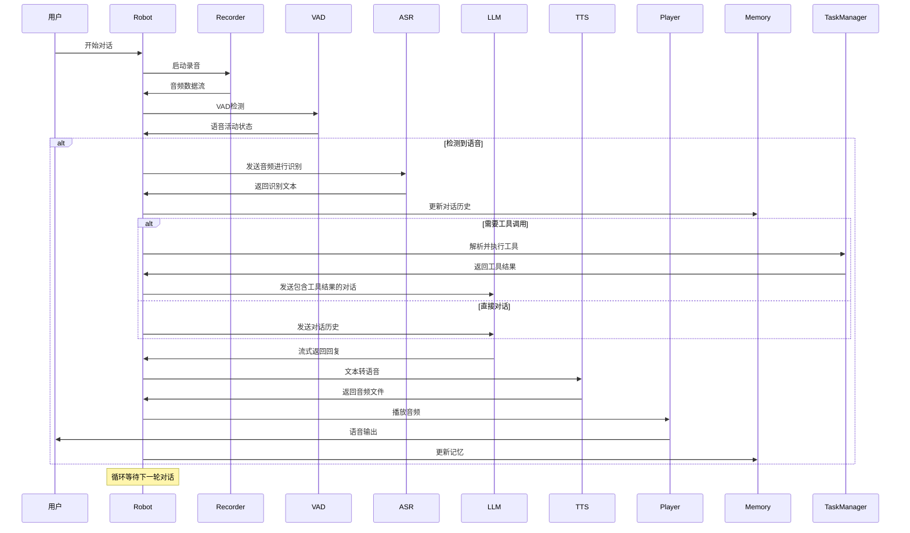
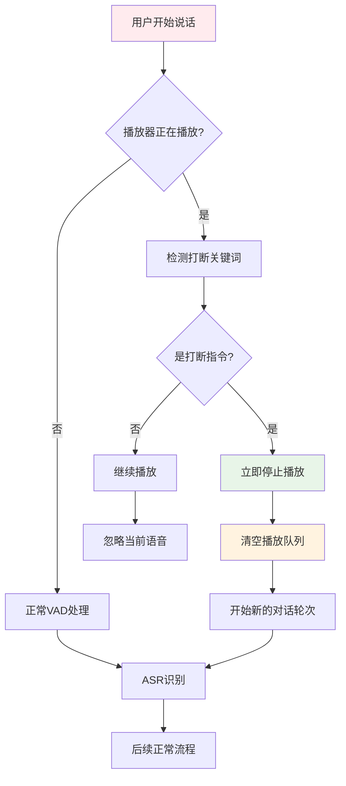
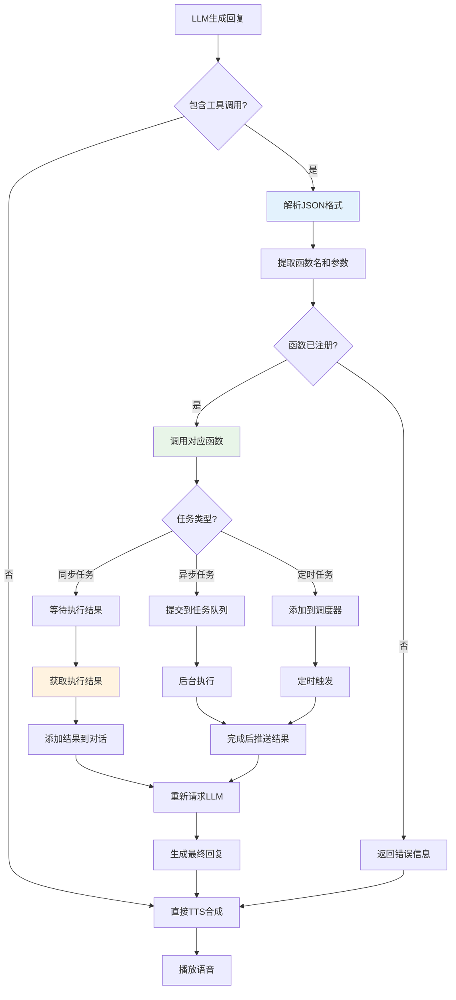

# 百聆语音对话助手 - 架构文档

## 项目概述

百聆是一个开源的语音对话助手，通过集成语音识别(ASR)、语音活动检测(VAD)、大语言模型(LLM)和语音合成(TTS)技术，实现类似GPT-4o的语音对话体验，端到端时延约800ms。

## 主要功能模块

### 1. 核心模块 (bailing/)

#### 1.1 Robot (robot.py)
- **功能**: 系统核心控制器，负责协调各个模块的工作
- **职责**: 
  - 管理音频队列和对话流程
  - 处理用户打断逻辑
  - 协调ASR、LLM、TTS、VAD等模块
  - 管理任务和记忆系统

#### 1.2 录音模块 (recorder.py)
- **功能**: 音频输入采集
- **实现**: RecorderPyAudio
- **参数**: 16kHz采样率，单声道，512字节缓冲区

#### 1.3 语音活动检测 (vad.py)
- **功能**: 检测语音活动，过滤静音片段
- **实现**: SileroVAD
- **特性**: 可配置阈值和最小静音持续时间

#### 1.4 语音识别 (asr.py)
- **功能**: 将语音转换为文本
- **实现**: FunASR (基于SenseVoiceSmall模型)
- **特性**: 支持流式识别，自动保存音频文件

#### 1.5 大语言模型 (llm.py)
- **功能**: 理解用户意图，生成回复
- **实现**: OpenAILLM (兼容DeepSeek API)
- **特性**: 支持流式响应和工具调用

#### 1.6 语音合成 (tts.py)
- **功能**: 将文本转换为语音
- **实现**: 支持多种TTS引擎
  - EdgeTTS: 微软语音合成
  - MacTTS: macOS系统TTS
  - ChatTTS: 开源TTS模型
  - GTTS: Google TTS

#### 1.7 音频播放 (player.py)
- **功能**: 播放合成的语音
- **实现**: 支持多种播放器
  - PygameSoundPlayer
  - CmdPlayer
  - SoundDevicePlayer

#### 1.8 对话管理 (dialogue.py)
- **功能**: 管理对话历史和消息
- **特性**: 
  - Message类：封装单条消息
  - Dialogue类：管理对话序列
  - 支持工具调用消息格式

#### 1.9 记忆系统 (memory.py)
- **功能**: 长期记忆管理
- **特性**: 
  - 自动总结对话历史
  - 提取用户偏好和对话风格
  - 持久化存储记忆数据

### 2. 插件系统 (plugins/)

#### 2.1 函数注册器 (registry.py)
- **功能**: 管理可调用的工具函数
- **特性**: 
  - 装饰器模式注册函数
  - 支持不同的动作类型
  - 定义工具调用的行为模式

#### 2.2 任务管理器 (task_manager.py)
- **功能**: 管理异步任务执行
- **特性**: 
  - 线程池执行任务
  - 支持定时任务和耗时任务
  - 结果队列管理

#### 2.3 工具函数 (functions/)
- **get_weather.py**: 天气查询
- **web_search.py**: 网络搜索
- **schedule_task.py**: 任务调度
- **open_application.py**: 应用程序启动
- **search_local_documents.py**: 本地文档搜索
- **ielts_speaking_practice.py**: 雅思口语练习
- **aigc_manus.py**: AIGC手势控制

### 3. 配置系统 (config/)

#### 3.1 配置文件 (config.yaml)
- **模块选择**: 可配置使用的具体实现
- **参数配置**: 各模块的详细参数
- **功能开关**: 打断模式、任务模式等

### 4. Web服务 (server/)

#### 4.1 Web界面 (server.py)
- **功能**: 提供Web界面进行语音对话
- **技术**: Flask + WebSocket
- **特性**: 实时消息推送

## 系统执行流程

### 主要执行流程图

### 详细模块交互流程

### 打断处理流程

### 工具调用流程

## 技术特点

### 1. 模块化设计
- 各模块独立实现，支持灵活替换
- 统一的接口设计，便于扩展
- 配置驱动的模块选择

### 2. 异步处理
- 多线程音频处理
- 异步任务执行
- 流式语音合成和播放

### 3. 智能打断
- 实时语音活动检测
- 关键词识别打断
- 播放状态管理

### 4. 记忆管理
- 对话历史持久化
- 智能摘要生成
- 用户偏好学习

### 5. 工具集成
- 插件化工具系统
- 多种任务类型支持
- 动态函数注册

## 部署要求

### 硬件要求
- CPU: 无特殊要求，支持CPU推理
- 内存: 建议4GB以上
- 存储: 模型文件约1-2GB
- 音频设备: 麦克风和扬声器

### 软件依赖
- Python 3.11+
- PyTorch (CPU版本)
- 各模块特定依赖库

### 配置说明
- 支持多种ASR/TTS引擎切换
- 可配置的VAD参数
- 灵活的LLM API配置
- 自定义工具函数扩展

## 扩展指南

### 添加新的ASR引擎
1. 继承ASR抽象类
2. 实现recognizer方法
3. 在配置文件中注册

### 添加新的工具函数
1. 在functions目录创建新文件
2. 使用@register_function装饰器
3. 在function_calls_config.json中配置

### 自定义TTS引擎
1. 继承AbstractTTS类
2. 实现to_tts方法
3. 在配置中指定使用

这个架构设计确保了系统的可扩展性、可维护性和高性能，为用户提供流畅的语音对话体验。